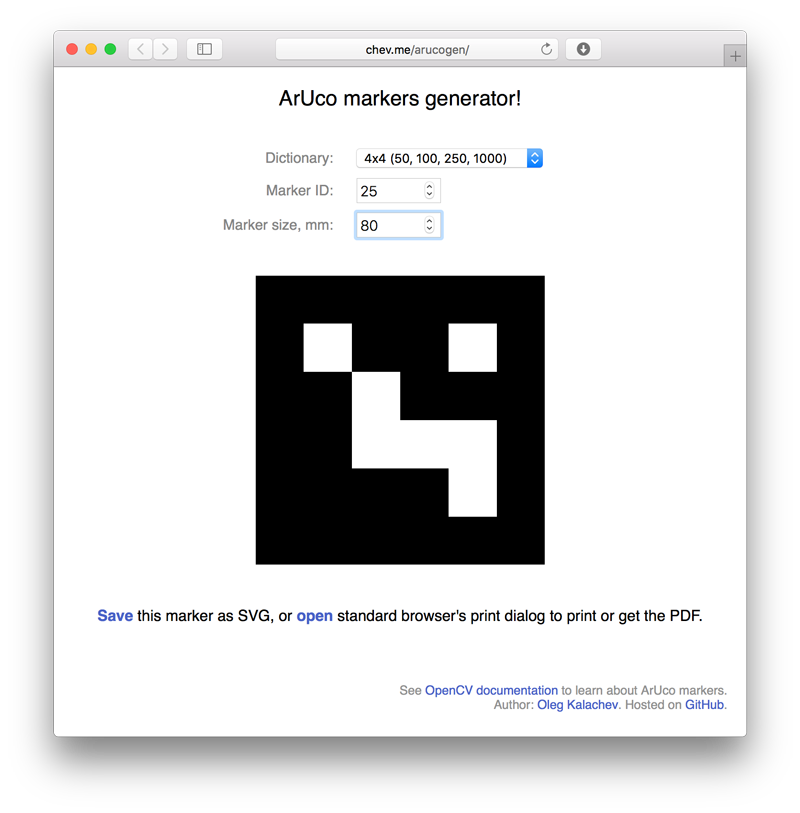

Online ArUco markers generator
====

Generate markers online and save them to SVG and PDF with ease: http://chev.me/arucogen/.

Markers dictionaries are taken from this URL:
https://raw.githubusercontent.com/opencv/opencv_contrib/master/modules/aruco/src/predefined_dictionaries.hpp.

Learn more about ArUco markers: https://docs.opencv.org/3.2.0/d5/dae/tutorial_aruco_detection.html.
